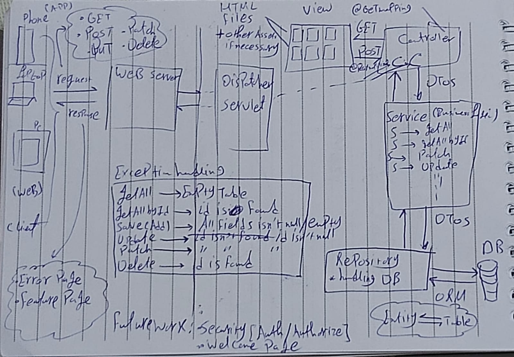
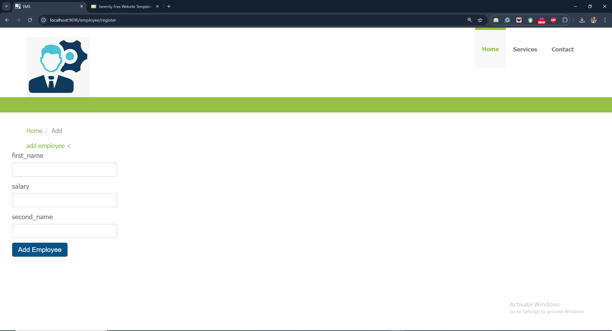
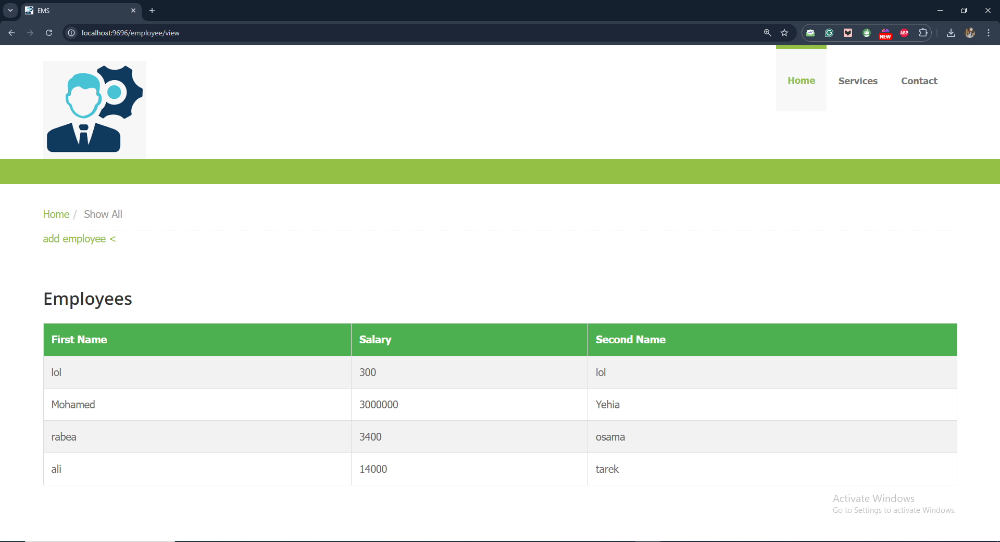
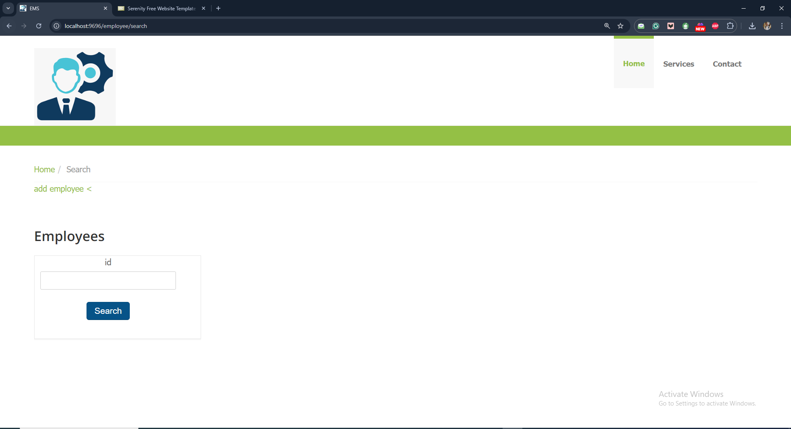
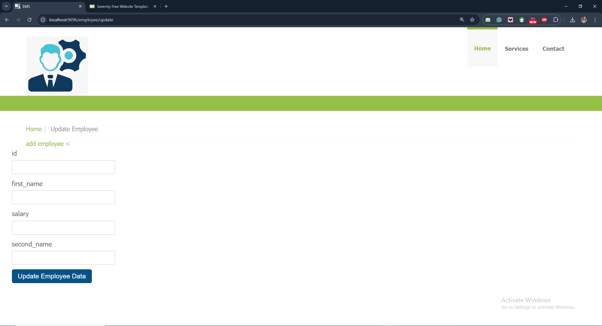
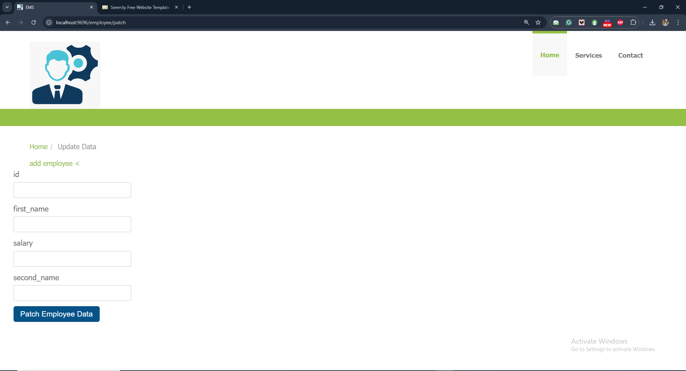
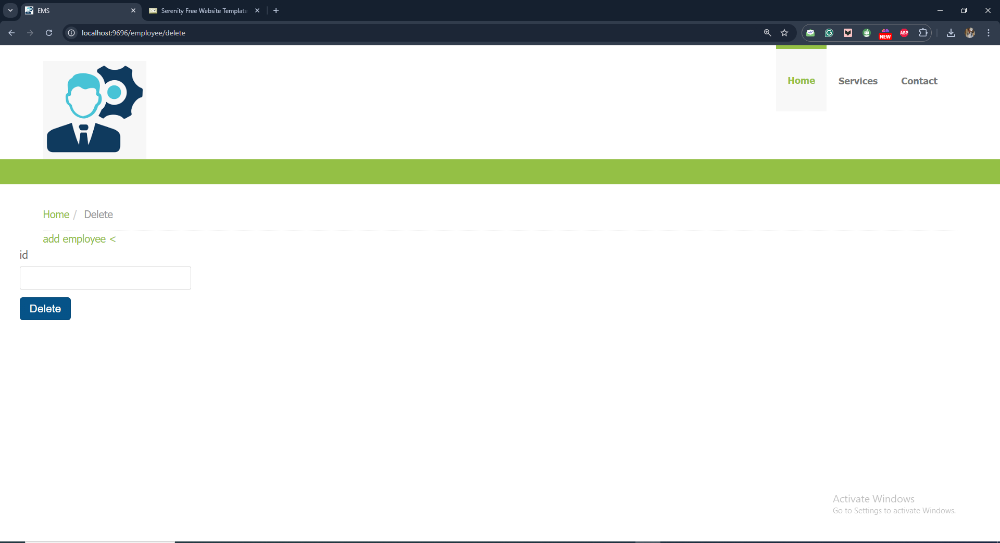
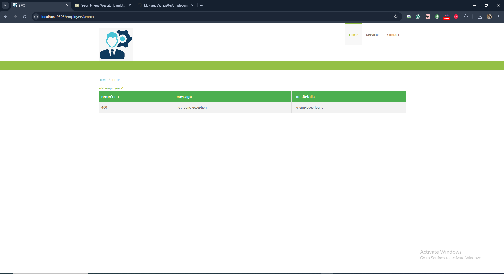
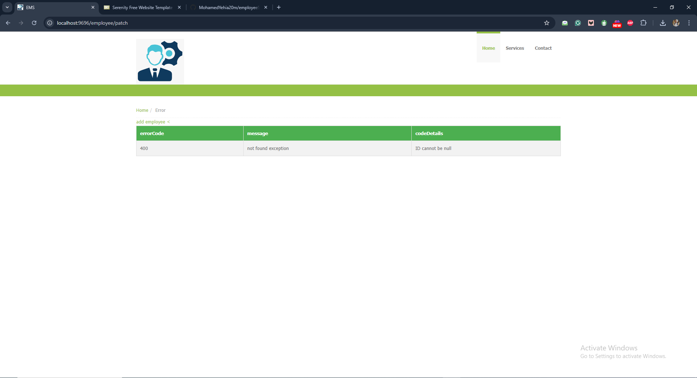

# EMS

## Overview
EMS is short for Employee Management System, a web application built with a RESTful API that manages employee data through various endpoints. The API supports basic CRUD operations for employee records, such as adding, updating, viewing, and deleting employee information. The system is designed to handle employee details like `first_name`, `last_name`, and `salary` in a streamlined and efficient manner, using standard HTTP methods for interaction.

The system follows a typical MVC (Model-View-Controller) architecture for efficient management and clear separation of concerns.

## Features
- **Create**

Add a new Employee to the system, each represents a Table record with `ID(PK)(AI)`, `first_name`, `salary`, and `last_name`, that record is mapped to the `EmployeeEntity` in the Application using ORM.

- **Read**
   
View all employees or search for specific employees using their unique `ID`.

- **Update** 

Modify employee information or patch specific fields.

- **Delete**
  
Remove employee records using their unique `ID`.

## Exception handling
- Handle missing data during employee creation.

- Handle employee not found when searching or performing other operations.

- Handle invalid requests, such as attempting to update or delete with null or invalid IDs.

## Design
This application uses the Serenity template for its UI, which is a clean and responsive design.
https://www.free-css.com/free-css-templates/page247/serenity

